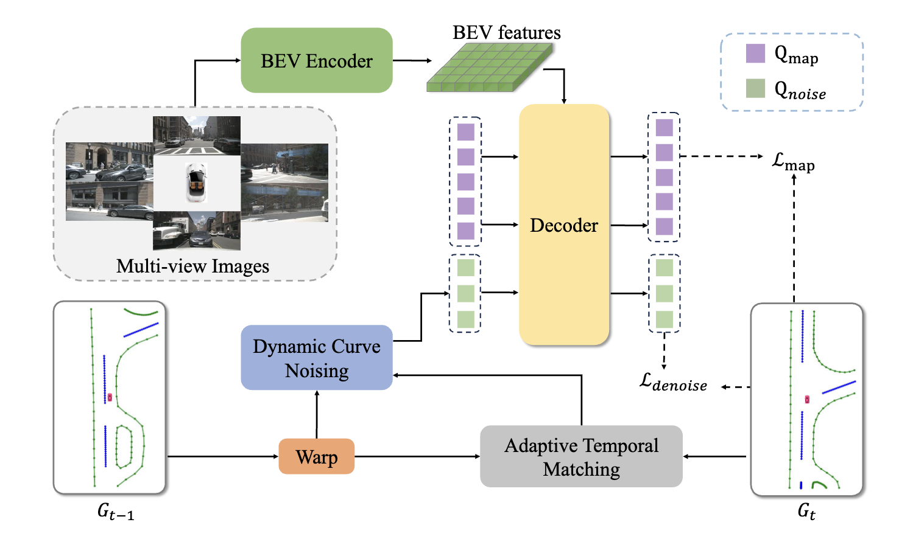

<div align="center">
  <h1>SQD-MapNet</h1>
  
  <h3>[ECCV 2024] Stream Query Denoising for Vectorized HD Map Construction </h3>
  
  [](https://arxiv.org/abs/2401.09112)
  
  
</div>

## Introduction
This repository is an official implementation of SQD-MapNet.

## Getting Started
### 1. Environment
**Step 1.** Create conda environment and activate it.

```
conda create --name sqdmapnet python=3.8 -y
conda activate sqdmapnet
```

**Step 2.** Install PyTorch.

```
pip install torch==1.9.0+cu111 torchvision==0.10.0+cu111 torchaudio==0.9.0 -f https://download.pytorch.org/whl/torch_stable.html
```

**Step 3.** Install MMCV series.

```
# Install mmcv-series
pip install mmcv-full==1.6.0
pip install mmdet==2.28.2
pip install mmsegmentation==0.30.0
git clone https://github.com/open-mmlab/mmdetection3d.git
cd mmdetection3d
git checkout v1.0.0rc6 
pip install -e .
pip install -r requirements.txt
```

**Step 4.** Install other requirements.

```
cd ..
pip install -r requirements.txt
```

### 2. Data Preparation
**Step 1.** Download [NuScenes](https://www.nuscenes.org/download) dataset to `./datasets/nuScenes`.

**Step 2.** Download [Argoverse2 (sensor)](https://argoverse.github.io/user-guide/getting_started.html#download-the-datasets) dataset to `./datasets/av2`.

**Step 3.** Generate annotation files for NuScenes dataset.

```
python tools/nuscenes_converter.py --data-root ./datasets/nuScenes
```

**Step 4.** Generate annotation files for Argoverse2 dataset.

```
python tools/argoverse_converter.py --data-root ./datasets/av2
```

### 3. Training and Validating
To train a model with 8 GPUs:

```
bash tools/dist_train.sh ${CONFIG} 8
```

To validate a model with 8 GPUs:

```
bash tools/dist_test.sh ${CONFIG} ${CEHCKPOINT} 8 --eval
```


## Results

### Results on NuScenes
| Range | $\mathrm{AP}_{ped}$ | $\mathrm{AP}_{div}$| $\mathrm{AP}_{bound}$ | $\mathrm{AP}$ | Config | Epoch | Checkpoint |
| :---: |   :---:  |  :---:  | :---:      |:---:|:---: |:---:   | :---:      |
| $60\times 30\ m$ | 63.0 | 65.5 | 63.3 | 63.9 | [Config](./plugin/configs/SQD-MapNet/sqdmapnet_nus_30x60m.py) | 24| [ckpt](https://drive.google.com/file/d/16SawLLN5wHqZRLUl6gHxdRHoyyhn_vBc/view?usp=drive_link)|
| $100\times 50\ m$ | 67.0 | 65.5 | 59.5 | 64.0 | [Config](./plugin/configs/SQD-MapNet/sqdmapnet_nus_50x100m.py)| 24 | [ckpt](https://drive.google.com/file/d/1ftv760aSCIRyZYBjyudjtDVflyj7amTo/view?usp=drive_link)|


## 📖 Citation

If you find our code or paper helps, please consider citing:

```bibtex
@article{wang2024stream,
  title={Stream query denoising for vectorized hd map construction},
  author={Wang, Shuo and Jia, Fan and Liu, Yingfei and Zhao, Yucheng and Chen, Zehui and Wang, Tiancai and Zhang, Chi and Zhang, Xiangyu and Zhao, Feng},
  journal={arXiv preprint arXiv:2401.09112},
  year={2024}
}
```

## Acknowledgments

We sincerely thank the open-sourcing of these works where our code is based on:
[StreamMapNet](https://github.com/yuantianyuan01/StreamMapNet) and [DN-DETR](https://github.com/IDEA-Research/DN-DETR).